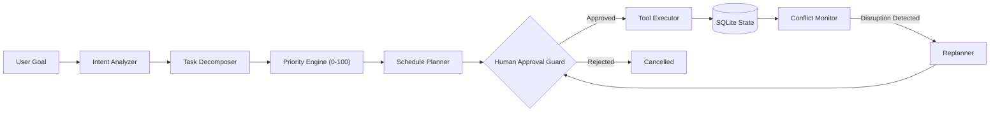
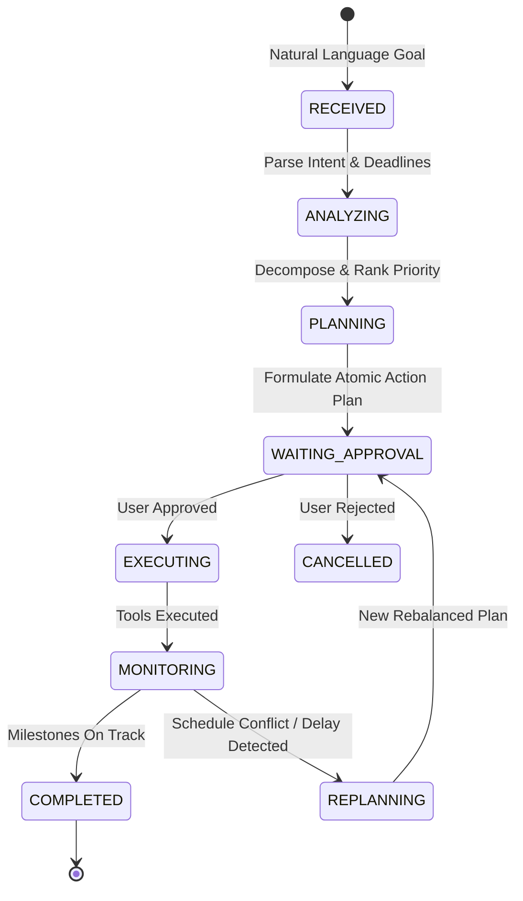

# TaskPilot AI
> **Autonomous Personal Productivity Agent**  
> *“TaskPilot AI doesn't just tell users what to do — it plans, acts, monitors, and adapts while keeping the human in control.”*

[](LICENSE)
[](https://www.python.org/)
[](https://flask.palletsprojects.com/)
[](https://github.com/)
[](https://github.com/)

---

## 📌 Problem Statement
Traditional AI assistants primarily respond to user queries with walls of static text. When given complex, multi-milestone objectives (such as preparing for upcoming exams while completing multiple coursework assignments), standard chatbots cannot independently break down goals, schedule time blocks, interact with tools, or detect when a student falls behind.

## 🚀 The TaskPilot AI Solution
**TaskPilot AI** is an autonomous productivity agent with genuine internal tool execution, multi-factor urgency calculations, human-in-the-loop safety boundaries, and proactive conflict resolution.



---

## ⚡ Why TaskPilot is Different: Chatbot vs. Autonomous Agent

| Dimension | Traditional Chatbot | TaskPilot AI (Autonomous Agent) |
| :--- | :--- | :--- |
| **Interaction Model** | Passive Question ➔ Answer | Goal ➔ Intent ➔ Planning ➔ Execution ➔ Adaptation |
| **Tool Usage** | Mocked in prose or non-existent | Real allowlisted tools (`task_manager`, `scheduler`, etc.) |
| **Human Oversight** | No execution risk boundaries | Explicit **Human-in-the-Loop** approval queue |
| **State Persistence** | Transient chat session memory | Relational persistence in SQLite (tasks, subtasks, logs) |
| **Handling Failures** | Forgotten on the next prompt | Detects conflicts (`MISSED_SESSION`), recalculates capacity, and **replans** |
| **Auditability** | Opaque text generation | Complete timeline stepper with timestamped tool audit log |

---

## 🛠️ System Architecture

### Agent Finite State Machine
The agent execution loop transitions deterministically through a finite set of verifiable states:

```
RECEIVED ➔ ANALYZING ➔ PLANNING ➔ WAITING_APPROVAL ➔ EXECUTING ➔ MONITORING ➔ REPLANNING ➔ COMPLETED
```



### Explainable Multi-Factor Priority Engine
Tasks are ranked according to an explainable mathematical formula:

$$\text{Priority Score} = (\text{Urgency} \times 0.40) + (\text{Importance} \times 0.30) + (\text{Effort} \times 0.20) + (\text{Dependencies} \times 0.10)$$

- **Urgency (40%)**: Derived dynamically from remaining days until deadline.
- **Importance (30%)**: Critical (100) / High (85) / Medium (60) / Low (30).
- **Effort (20%)**: Normalized against daily capacity limits.
- **Dependency Impact (10%)**: Measures how many downstream tasks depend on this completion.

---

## 🧰 Internal Allowlisted Tools

TaskPilot operates through real, isolated internal Python tools:

1. **`task_manager`**:
   - `create_task()`: Creates top-level milestone tasks and modular subtasks.
   - `update_task()`: Modifies deadlines, descriptions, and priorities.
   - `complete_task()`: Cascades completion status down to subtasks and schedule blocks.
   - `delete_task()`: Safely removes tasks.
   - `list_tasks()`: Retrieves active or filtered tasks.
2. **`scheduler`**:
   - `create_schedule()`: Allocates evening study blocks (e.g., 6:00 PM – 9:00 PM).
   - `update_schedule()`: Updates session timings and notes.
   - `mark_missed()`: Flags uncompleted sessions to trigger replanning.
   - `clear_all_schedules()`: Cleans obsolete future slots during schedule rebalancing.
   - `get_schedule()`: Retrieves chronological agendas.
3. **`research_tool`**:
   - `search_information()`: Queries academic citations and knowledge sources.
   - `summarize_information()`: Generates structured findings, executive summaries, and action checklists.
4. **`planner`**:
   - `generate_plan()`: Balances daily workload across available evening hours.
   - `prioritize_tasks()`: Computes multi-factor scores and explainability explanations.
   - `replan()`: Re-allocates unfinished tasks into future available slots.
5. **`monitor`**:
   - `get_progress()`: Global completion rate, total hours logged, and active milestones.
   - `detect_conflict()`: Flags overdue deadlines, missed study blocks, or daily overloads.
   - `detect_overdue_tasks()`: Identifies past-deadline pending items.

---

## 🛡️ Human-in-the-Loop Oversight
TaskPilot enforces strict safety controls:
- **No Silent Mutations**: The agent cannot create tasks or book calendar sessions without user authorization.
- **Action Plan Presentation**: Proposed actions are rendered in an audit table showing category, target tool, parameters, and rationale.
- **Audit Trail**: Every execution records:
  - `User Approved At`: ISO timestamp
  - `Agent Executed At`: ISO timestamp
  - `Tool Call Parameters`: Captured in `tool_calls` table

---

## 🔄 Autonomous Conflict Resolution & Replanning
When unexpected events occur (such as a student falling ill or missing an evening session), TaskPilot handles adaptation seamlessly:

1. **Event**: User inputs *"I couldn't study today"*.
2. **Conflict Detection**: Monitor flags missed study blocks and detects that the original schedule is no longer feasible.
3. **Capacity Recalculation**: The agent calculates remaining time, shifts uncompleted work forward, and preserves urgent deadlines.
4. **Comparison Screen**: Displays **Original Plan** vs. **New Rebalanced Plan**.
5. **Human Approval**: The user reviews and signs off on the updated schedule.
6. **Execution**: The scheduler clears obsolete slots and commits the new calendar.

---

## 💻 Tech Stack
- **Backend**: Python 3.10+, Flask 3.1
- **Database**: SQLite (Zero-dependency transactional relational storage)
- **Frontend**: Modern Vanilla JS (ES6+), Semantic HTML5, Custom SaaS Dark-Mode CSS
- **Testing**: `pytest` (19 comprehensive unit & integration tests)
- **Deployment**: Docker, Gunicorn WSGI, Container Ready

---

## 📦 Project Structure

```
TaskPilot-AI/
├── app/
│   ├── __init__.py              # Application factory & SQLite setup
│   ├── config.py                # Environment configurations
│   ├── models/
│   │   ├── __init__.py
│   │   └── database.py          # SQLite connection manager & schema DDL
│   ├── tools/
│   │   ├── __init__.py          # Tool registry definitions
│   │   ├── tool_registry.py     # Allowlisted execution engine & audit logger
│   │   ├── task_tool.py         # Task Manager Tool
│   │   ├── scheduler_tool.py    # Scheduler Tool
│   │   ├── research_tool.py     # Research Assistant Tool
│   │   ├── planner_tool.py      # Planner & Priority Tool
│   │   └── monitor_tool.py      # Conflict & Progress Monitor Tool
│   ├── services/
│   │   ├── __init__.py
│   │   ├── intent_analyzer.py   # Intent classification & entity extraction
│   │   ├── decomposer.py        # Task decomposition engine
│   │   ├── priority_engine.py   # Explainable priority scoring
│   │   ├── planner.py           # Schedule balancing service
│   │   ├── approval_manager.py  # Human-in-the-loop approval coordinator
│   │   ├── executor.py          # Action execution pipeline
│   │   ├── monitor.py           # Progress & conflict monitor service
│   │   ├── replanner.py         # Problem simulation & replanning engine
│   │   ├── research_service.py  # Autonomous academic research workflow
│   │   └── agent.py             # Finite State Machine orchestrator
│   ├── routes/
│   │   ├── __init__.py
│   │   ├── api.py               # REST API endpoints
│   │   └── web.py               # Web dashboard controllers & /health
│   ├── static/
│   │   ├── css/style.css        # Professional dark-mode AI SaaS UI
│   │   └── js/
│   │       ├── app.js           # Interactive UI, approvals, replanning
│   │       └── demo.js          # Animated live demo controller for judges
│   └── templates/
│       ├── base.html            # Master layout & modal overlays
│       ├── dashboard.html       # Hero goal input, active tasks, agent feed
│       ├── tasks.html           # Full task management & subtask view
│       ├── planner.html         # Visual schedule planner
│       ├── runs.html            # Agent lifecycle audit stepper
│       ├── approvals.html       # Human approval center
│       ├── calendar.html        # Chronological agenda
│       ├── research.html        # Academic research synthesizer
│       └── analytics.html       # Conflict telemetry & progress metrics
├── tests/
│   ├── conftest.py              # Isolated test database fixtures
│   ├── test_tools.py            # Tool CRUD unit tests
│   ├── test_agent_and_workflow.py # End-to-end agent workflow tests
│   ├── test_api.py              # REST API endpoint tests
│   └── test_pages_and_edge_cases.py # Capacity overflow & UI tests
├── Dockerfile                   # Cloud container specification
├── docker-compose.yml           # Multi-environment orchestrator
├── requirements.txt             # Production dependencies
├── .env.example                 # Sample configuration
├── .gitignore                   # Excludes secrets, instance DBs, caches
├── run.py                       # Local execution entry point
└── README.md                    # Comprehensive documentation
```

---

## ⚙️ Installation & Local Setup

### 1. Clone & Navigate
```bash
git clone https://github.com/your-username/TaskPilot-AI.git
cd TaskPilot-AI
```

### 2. Set Up Virtual Environment
```bash
python -m venv venv

# Windows
.\venv\Scripts\activate

# Linux / macOS
source venv/bin/activate
```

### 3. Install Dependencies
```bash
pip install -r requirements.txt
```

### 4. Configure Environment
```bash
cp .env.example .env
```
*(No external API keys are required to run the demo. TaskPilot includes deterministic autonomous execution engines and knowledge synthesizers.)*

### 5. Launch Application
```bash
python run.py
```
Open your browser at **`http://localhost:5000`**.

---

## 🧪 Running Automated Tests

Run the full pytest suite (19 tests covering tool execution, intent analysis, planning, conflict detection, replanning, and REST APIs):

```bash
python -m pytest -v
```

Output:
```
tests/test_agent_and_workflow.py::test_intent_analyzer PASSED
tests/test_agent_and_workflow.py::test_full_agent_workflow PASSED
tests/test_api.py::test_health_check PASSED
tests/test_api.py::test_api_task_crud PASSED
tests/test_api.py::test_api_agent_lifecycle_and_approval PASSED
tests/test_api.py::test_api_simulate_delay PASSED
tests/test_api.py::test_api_research PASSED
tests/test_api.py::test_api_analytics PASSED
tests/test_api.py::test_api_error_handling PASSED
tests/test_pages_and_edge_cases.py::test_pages_render PASSED
tests/test_pages_and_edge_cases.py::test_priority_formula_breakdown PASSED
tests/test_pages_and_edge_cases.py::test_workload_capacity_feasibility_check PASSED
tests/test_pages_and_edge_cases.py::test_approval_rejection_flow PASSED
tests/test_pages_and_edge_cases.py::test_conflict_detection_and_capacity_overflow PASSED
tests/test_tools.py::test_task_crud PASSED
tests/test_tools.py::test_scheduler_crud PASSED
tests/test_tools.py::test_research_tool PASSED
tests/test_tools.py::test_planner_priority_and_schedule PASSED
tests/test_tools.py::test_monitor_tool PASSED
===================== 19 passed in 1.78s =====================
```

---

## 🏆 Hackathon Live Demo Walkthrough

### Scenario
A student enters the following natural-language request:
> *"I have a Java exam on Monday, DBMS assignment due tomorrow, and project presentation on Wednesday. I have 3 hours available every evening. Create a study plan."*

### Step-by-Step Flow
1. **Click "Run Autonomous Demo"** on the top navigation bar.
2. **Intent Analysis**: TaskPilot detects academic milestones, extracts deadlines (*tomorrow*, *Monday*, *Wednesday*), and sets daily capacity (*3h/day*).
3. **Decomposition**: Decomposes large goals into 11 modular subtasks (e.g. *Read requirements*, *ER design*, *SQL normalization*, *OOP review*, *Mock test*).
4. **Prioritization**: Calculates urgency and effort scores. *DBMS Assignment* is ranked **HIGH** because it is due tomorrow.
5. **Schedule Generation**: Assembles evening slots (6:00 PM – 9:00 PM) across days without exceeding 3h/day.
6. **Human-in-the-Loop Sign-off**: Displays 14 atomic tool actions awaiting confirmation. Click **[Approve & Execute]**.
7. **Execution**: Internal tools commit the tasks and schedule. The audit trail records completion timestamps.
8. **Autonomous Replanning Showcase**:
   - Click **[Simulate: Couldn't Study Today]**.
   - Conflict Detected: TaskPilot identifies missed sessions and flags the schedule as unfeasible.
   - Shows **Original Plan** vs. **New Rebalanced Plan**.
   - Click **[Approve & Apply New Schedule]** to observe autonomous schedule rebalancing.

---

## 🌐 REST API Reference

| Method | Endpoint | Description |
| :--- | :--- | :--- |
| `GET` | `/health` | Health check endpoint (`{"status": "healthy"}`) |
| `POST` | `/api/agent/run` | Submits natural language goal for planning |
| `POST` | `/api/agent/approve` | Human authorization to execute atomic tool actions |
| `POST` | `/api/agent/reject` | Rejects proposed action plan |
| `GET` | `/api/agent/runs` | Lists historical agent runs and state transitions |
| `GET` | `/api/agent/runs/<id>` | Retrieves execution audit trail and tool call logs |
| `GET` | `/api/tasks` | Lists active tasks |
| `POST` | `/api/tasks` | Creates a task |
| `PUT` | `/api/tasks/<id>` | Updates a task |
| `DELETE` | `/api/tasks/<id>` | Deletes a task |
| `POST` | `/api/tasks/<id>/complete`| Marks a task as completed |
| `GET` | `/api/schedule` | Retrieves chronological schedule sessions |
| `POST` | `/api/planner/generate`| Generates schedule based on daily hours |
| `POST` | `/api/planner/simulate-delay` | Simulates missed study session and generates replan |
| `POST` | `/api/research` | Executes autonomous research synthesis |
| `GET` | `/api/analytics` | Returns progress and conflict telemetry |
| `POST` | `/api/demo/seed` | Seeds hackathon demo scenario |
| `POST` | `/api/demo/reset` | Resets database to clean state |

---

## ☁️ Cloud Deployment Readiness

TaskPilot AI is designed for containerized cloud deployment on AWS ECS, Google Cloud Run, Azure Container Apps, or Render:

### Docker Deployment
```bash
# Build container image
docker build -t taskpilot-ai .

# Run container
docker run -d -p 5000:5000 --name taskpilot taskpilot-ai
```

### Docker Compose
```bash
docker-compose up -d
```

### Production Health Check
Cloud load balancers can poll:
```
GET /health
```
Returns HTTP 200:
```json
{
  "service": "TaskPilot AI",
  "status": "healthy",
  "version": "1.0.0",
  "timestamp": "2026-10-08T18:43:20.394972"
}
```

---

## 🔒 Security & Best Practices
- **Allowlisted Tool Execution**: The agent cannot execute arbitrary shell or system commands. All actions pass through the validated `ToolRegistry`.
- **Zero Exposed Secrets**: Sensitive keys are loaded exclusively from `.env`. A complete `.env.example` is provided, and `.env` is excluded in `.gitignore`.
- **Parameterized SQL Queries**: All SQLite queries use strict parameter substitution to eliminate SQL injection risks.
- **Input Validation**: All payloads undergo validation, preventing infinite loops or impossible scheduling loads.

---

## 🔮 Future Improvements
1. **Google Calendar & Notion Integration**: Sync scheduled sessions with personal calendar feeds.
2. **Push Notifications**: Proactive reminders before study intervals begin.
3. **Multi-Agent Collaboration**: Specialized subagents for course syllabus scraping and flashcard generation.

---

## 📄 License
This project is open-source under the MIT License.
